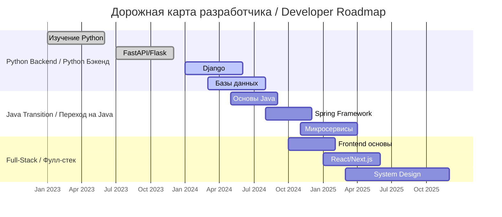

<!-- Главный баннер с анимацией -->
<p align="center">
  
</p>

<!-- Аниме аватар и основная информация -->
<div align="center">
  
  
  <!-- Анимированный текст -->
  <div style="margin: 20px 0;">
    
  </div>
  
  <!-- Социальные кнопки -->
  <div style="margin: 25px 0;">
    <a href="https://www.instagram.com/erasylcodebus/" target="_blank">
      
    </a>
    <a href="https://github.com/ErasylCoder" target="_blank">
      
    </a>
    
    
  </div>
  
  
</div>

---

## 🎯 **Обо мне / About Me**

```python
class ЕрасылAmritay:
    def __init__(self):
        self.real_name = "Ерасыл (Yerasyl)"
        self.github_name = "ErasylCoder"
        self.location = "Актобе, Казахстан | Aktobe, Kazakhstan"
        self.current_role = "Python Backend Developer"
        self.short_goal = "Java Backend Developer"
        self.long_goal = "Full-Stack Developer"
        
    def current_stack(self):
        return {
            "Языки / Languages": ["Python", "SQL"],
            "Фреймворки / Frameworks": ["FastAPI", "Django", "Flask"],
            "Базы данных / Databases": ["PostgreSQL", "SQLite", "Redis"],
            "Инструменты / Tools": ["Docker", "Git", "Linux", "Nginx"]
        }
    
    def learning_path(self):
        return [
            "🎯 Этап 1: Python Backend (Текущий) / Stage 1: Python Backend (Current)",
            "🚀 Этап 2: Java & ООП / Stage 2: Java & OOP",
            "☕ Этап 3: Spring Framework / Stage 3: Spring Framework",
            "🌐 Этап 4: System Design / Stage 4: System Design",
            "⚡ Этап 5: Full-Stack / Stage 5: Full-Stack"
        ]
    
    def motto(self):
        return "Код — это поэзия, написанная логикой 💻 | Code is poetry written in logic 💻"

dev = ЕрасылAmritay()
```

---

## 🛠️ **Мой стек технологий / My Tech Stack**

### **🔥 Текущие технологии / Current Technologies**
<div align="center">
  <table>
    <tr>
      <td align="center">
        
        <br>
        <sub><b>Backend / Бэкенд</b></sub>
      </td>
      <td align="center">
        
        <br>
        <sub><b>Databases / Базы данных</b></sub>
      </td>
    </tr>
    <tr>
      <td align="center">
        
        <br>
        <sub><b>DevOps / Девопс</b></sub>
      </td>
      <td align="center">
        
        <br>
        <sub><b>Tools / Инструменты</b></sub>
      </td>
    </tr>
  </table>
</div>

### **📚 Изучаю сейчас / Learning Now**
<div align="center">
  <div style="display: inline-block; margin: 15px;">
    
    
    
    
  </div>
  <br>
  <div style="display: inline-block; margin: 15px;">
    
    
    
    
  </div>
</div>

---

## 📊 **Статистика GitHub / GitHub Statistics**

### **📈 Основная статистика / Main Stats**
<div align="center">
  <table>
    <tr>
      <td width="50%">
        
      </td>
      <td width="50%">
        
      </td>
    </tr>
    <tr>
      <td width="50%">
        
      </td>
      <td width="50%">
        
      </td>
    </tr>
  </table>
</div>

### **📊 График активности / Activity Graph**
<div align="center">
  
</div>

### **🎯 Дополнительная статистика / Additional Metrics**
<div align="center">
  <table>
    <tr>
      <td align="center">
        
        <br>
        <sub><b>Профиль / Profile</b></sub>
      </td>
      <td align="center">
        <!-- Wakatime Stats -->
        
      </td>
    </tr>
  </table>
</div>

---

## 🗺️ **Дорожная карта / Roadmap**



---

## 🎨 **Активность кодинга / Coding Activity**

<div align="center">
  
  <!-- Snake Animation -->
  
  
  <br>
  
  <!-- Статистика коммитов -->
  <div style="display: inline-block; margin: 10px;">
    
    
  </div>
  
</div>

---

## 📌 **Закрепленные проекты / Pinned Projects**

<div align="center">
  <table>
    <tr>
      <td align="center" width="50%">
        <a href="https://github.com/ErasylCoder/python-api-project">
          
        </a>
        <br>
        <sub><b>Python API Project</b></sub>
      </td>
      <td align="center" width="50%">
        <a href="https://github.com/ErasylCoder/django-ecommerce">
          
        </a>
        <br>
        <sub><b>Django E-commerce</b></sub>
      </td>
    </tr>
  </table>
</div>

---

## 🌟 **Связаться со мной / Connect with Me**

<div align="center">
  
  <!-- Основные контакты -->
  <a href="https://www.instagram.com/erasylcodebus/" target="_blank">
    
  </a>
  <a href="https://github.com/ErasylCoder" target="_blank">
    
  </a>
  
  <br><br>
  
  <!-- Статистика в реальном времени -->
  <div style="display: inline-block; margin: 10px;">
    
    
    
  </div>
  
</div>

---

<div align="center">
  
  <!-- Цитата дня -->
  
  
  <br><br>
  
  <!-- Анимированный подвал -->
  
  
  <p style="margin-top: 20px;">
    <i>💻 Кодирую из Актобе с страстью</i><br>
    <i>☕ Powered by coffee and determination</i><br>
    <i>🚀 На пути к становлению Full-Stack Developer</i>
  </p>
  
  <!-- Footer badges -->
  <div style="margin-top: 20px;">
    
    
    
    
  </div>
  
</div>

<!-- Snake Animation -->

```

## 📝 **Как использовать:**

1. **Создайте файл `README.md`** в репозитории с названием вашего профиля (ErasylCoder)
2. **Скопируйте и вставьте** весь код выше
3. **Для snake animation** создайте файл `.github/workflows/snake.yml`:
```yaml
name: Generate Snake
on:
  schedule:
    - cron: "0 0 * * *"
  workflow_dispatch:
jobs:
  build:
    runs-on: ubuntu-latest
    steps:
      - name: Generate Snake
        uses: Platane/snk@master
        with:
          github_user_name: ErasylCoder
          outputs: dist/github-contribution-grid-snake.svg
```

Этот профиль полностью билингвальный (русский/английский), содержит максимальную статистику, анимации и выглядит профессионально! 🚀
